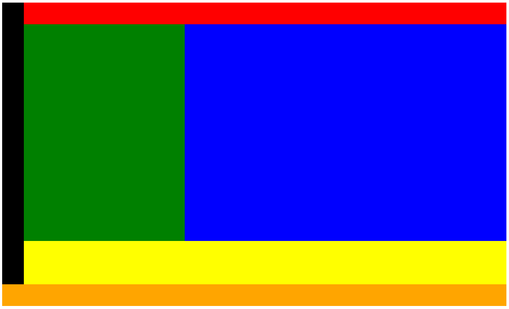

# CSS Grid

- [Complete Guide](https://css-tricks.com/snippets/css/complete-guide-grid/)
- [Classic](https://developer.mozilla.org/en-US/docs/Web/CSS/CSS_Grid_Layout)
- [Templates](https://developer.mozilla.org/en-US/docs/Web/CSS/grid-template-areas)
- [Grid by Examples](https://gridbyexample.com/examples/)

# Exercise

```html
<body>
    <div id="red"></div>
    <div id="green"></div>
    <div id="blue"></div>
    <div id="black"></div>
    <div id="yellow"></div>
    <div id="orange"></div>
</body>
```

```css
#red {
    background-color: red;
    min-height: 10px;
    min-width: 10px;
}
#green {
    background-color: green;
    min-height: 10px;
    min-width: 10px;
}
#blue {
    background-color: blue;
    min-height: 10px;
    min-width: 10px;
}
#black {
    background-color: black;
    min-height: 10px;
    min-width: 10px;
}
#yellow {
    background-color: yellow;
    min-height: 10px;
    min-width: 10px;
}
#orange {
    background-color: orange;
    min-height: 10px;
    min-width: 10px;
}
```

### Big



### Medium


### Small

